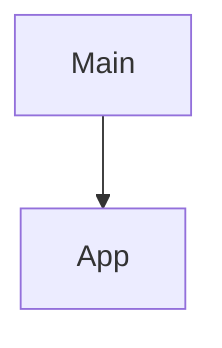

# 项目代码地图与架构

[English](code-map.md) | [简体中文](code-map.zh-CN.md)

## 📂 物理目录结构
- `/agent_context_handoff.egg-info`: Contains 5 files.
- `/agent_context_handoff/templates`: Contains 22 files.
- `/agent_context_handoff`: Contains 4 files.

## 🎯 关键入口与核心符号
- **Entry Function**: `main()` in [agent_context_handoff/cli.py](file://./agent_context_handoff/cli.py#L190)

## 🔗 内部模块调用/依赖关系图

